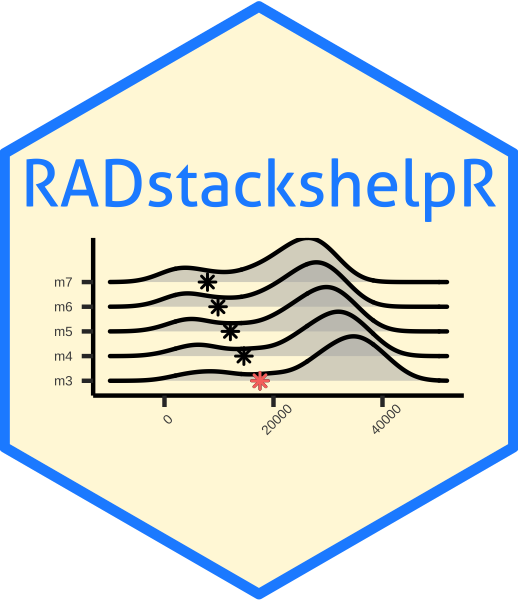

<!-- README.md is generated from README.Rmd. Please edit that file -->
RADstackshelpR 
==================================================================================

RADstackshelpR is designed to streamline the process of parameter optimization for denovo assembly of rad loci using the powerful computing and data visualization offered in R. You can check out the pkgdown website associated with the package, which details each function and hosts a comprehensive vignette, here: <https://devonderaad.github.io/RADstackshelpR/index.html>

Installation
------------

``` r
# Install development version from GitHub
devtools::install_github("DevonDeRaad/RADstackshelpR")
```

Usage
-----

RADstackshelpR packages a handful of useful wrapper functions together to streamline your RAD workflow.

### The pipeline

This denovo workflow relies on the program STACKS <https://catchenlab.life.illinois.edu/stacks/> which is designed to assemble loci and call variants from restriction-enzyme associated DNA sequence data (RADseq). The pipeline implemented here is based on the 2017 paper 'Lost in Parameter Space' <https://doi.org/10.1111/2041-210X.12775> which establishes clear recommendations for optimizing the parameters 'm', 'M', and 'n', during the process of assembling loci. This pipeline involves iterating over a range of values for each paramter (m: 3-7, M: 1-8, and n: M-1,M,M+1) and choosing the optimum value for each parameter. An example, comprehensive bash script for running all of these iterations in STACKS is available at <https://github.com/DevonDeRaad/RADstackshelpR/blob/master/denovo.stacks.pipeline.sh>. You can follow these steps, commenting and uncommenting the relevant parameter iterations as you go. A vignette detailing the implementation of RADstackshelpR with STACKS to produce a cohesive and reproducible pipeline for assembling RAD loci without a reference genome, lives here: <https://devonderaad.github.io/RADstackshelpR/articles/optimize_denovo.html>.
