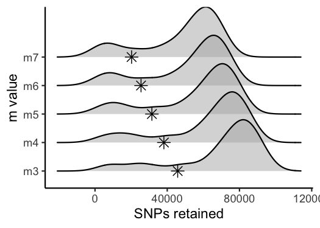
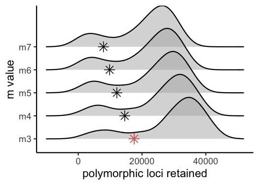
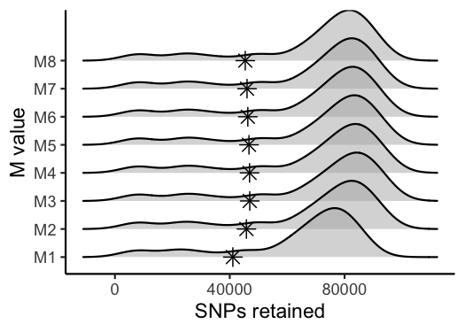
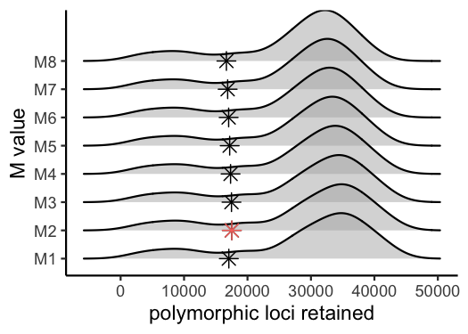
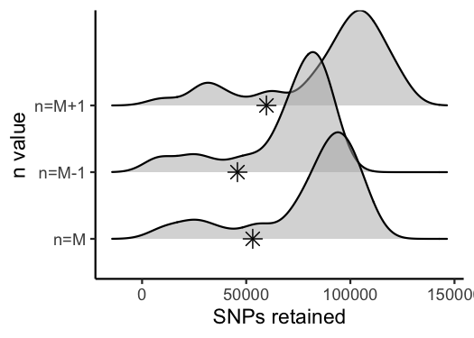
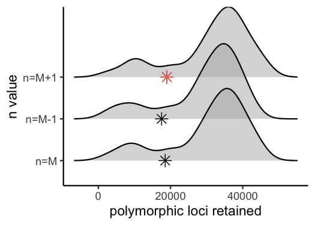
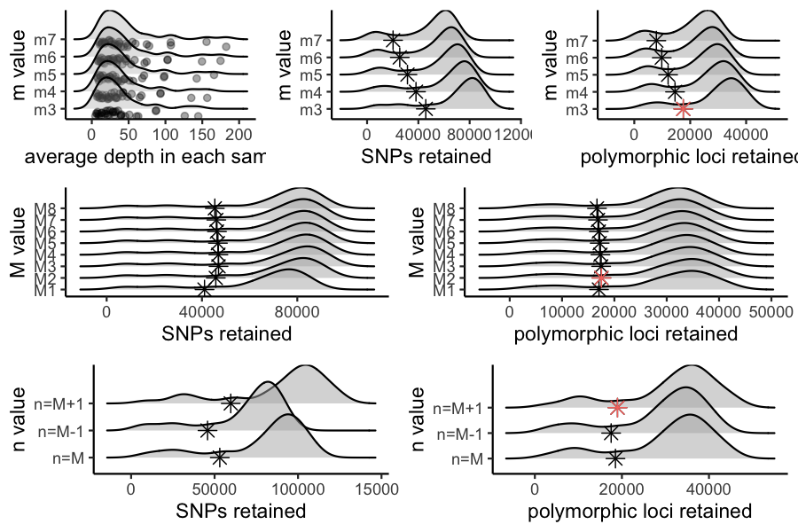

<!-- README.md is generated from README.Rmd. Please edit that file -->

# RADstackshelpR 

RADstackshelpR offers a handful of useful wrapper functions which
streamline the reading, analyzing, and visualizing of variant call
format (vcf) files in R. The internal calls of each function rely
heavily on the excellent R package
[vcfR](https://knausb.github.io/vcfR_documentation/) to read in and
analyze vcf files, and the widely renowned
[ggplot2](https://ggplot2.tidyverse.org/) package to create elegant
visualizations. This package was designed to facilitate an explicit
pipeline for optimizing
[STACKS](https://catchenlab.life.illinois.edu/stacks/) paramaters during
de novo (without a reference genome) assembly and variant calling of
restriction-enzyme associated DNA sequence (RADseq) data. STACKS is a
relatively user-friendly, command-line program designed for assembling
RADseq data into loci, and performing variant (SNP) calling. STACKS
offers users flexibility in setting parameters during the assembly
process, allowing custom parameter optimization for any input dataset.
The pipeline implemented here is based on the 2017 paper [Lost in
Parameter Space](https://doi.org/10.1111/2041-210X.12775) which
establishes clear recommendations for optimizing the parameters ‘m’,
‘M’, and ‘n’, during the process of assembling loci.

Despite these clear recommendations, the full range of parameter space
suggested to explore in this paper is often left unexplored in empirical
studies, due to the computational and logistical difficulty of executing
and analyzing 16 separate runs through the entire STACKS pipeline. This
package is designed to automate that logistical difficulty, leaving
users with a clear set of steps to follow for thoroughly optimized, de
novo RAD locus assembly and variant calling. For more details on
RADstackshelpR please check out this
[website](https://devonderaad.github.io/RADstackshelpR/index.html) built
using [pkgdown](https://pkgdown.r-lib.org/). Otherwise, simply follow
the steps below to run the optimized de novo assembly pipeline.

## Installation

``` r
# Install development version from GitHub
devtools::install_github("DevonDeRaad/RADstackshelpR")
```

## Usage

The first step is demultiplexing your sequence data using the
‘process\_radtags’ function from STACKS, which could be executed by
running something like this in a terminal window, if your raw sequence
file is in your working directory, and you used the enzyme ‘ndeI’ as
your cutter:

### Demultiplex

``` bash
/home/path/to/stacks-2.41/process_radtags -p .  -o . -b plate.1.barcodes.txt -e ndeI -r -c -q
```

More details on demultiplexing using process\_radtags can be found
[here](https://catchenlab.life.illinois.edu/stacks/comp/process_radtags.php)

### Iterate over potential values for the ‘m’ parameter in the ‘ustacks’ module

Once you have an individual zipped fastq file for each sample, we need
to iterate over the relevant values for ‘m’ within the ‘ustacks’ module
(here using 15 threads at each step to speed up computation). Running
the following code in a terminal window will perform five separate
iterations of the entire STACKS pipeline, each with a different
parameter setting for ‘m’ (3-7), and save the results as an unfiltered
vcf file in a specified directory.

``` bash
#designate all sample ID's to a single variable called 'files', each sample should be in the directory, and the filename should match this designation except for the extension, e.g., 'sample_2' = 'sample_2.fq.gz'
files="sample_1
sample_2
sample_3
sample_4
sample_5"

# Build loci de novo in each sample for the single-end reads only.
# -M — Maximum distance (in nucleotides) allowed between stacks (default 2).
# -m — Minimum depth of coverage required to create a stack (default 3).
#here, we will vary m from 3-7, and leave all other paramaters default

for i in {3..7}
do
#create a directory to hold this unique iteration:
mkdir stacks_m$i
#run ustacks with m equal to the current iteration (3-7) for each sample
id=1
for sample in $files
do
    /home/path/to/stacks-2.41/ustacks -f ${sample}.fq.gz -o stacks_m$i -i $id -m $i -p 15
    let "id+=1"
done
## Run cstacks to compile stacks between samples. Popmap is a file in working directory called 'pipeline_popmap.txt'
/home/path/to/stacks-2.41/cstacks -P stacks_m$i -M pipeline_popmap.txt -p 15
## Run sstacks. Match all samples supplied in the population map against the catalog.
/home/path/to/stacks-2.41/sstacks -P stacks_m$i -M pipeline_popmap.txt -p 15
## Run tsv2bam to transpose the data so it is stored by locus, instead of by sample.
/home/path/to/stacks-2.41/tsv2bam -P stacks_m$i -M pipeline_popmap.txt -t 15
## Run gstacks: build a paired-end contig from the metapopulation data (if paired-reads provided),
## align reads per sample, call variant sites in the population, genotypes in each individual.
/home/path/to/stacks-2.41/gstacks -P stacks_m$i -M pipeline_popmap.txt -t 15
## Run populations completely unfiltered and output unfiltered vcf, for input to the RADstackshelpR package
/home/path/to/stacks-2.41/populations -P stacks_m$i -M pipeline_popmap.txt --vcf -t 15
done
```

You should now have five directories, named: stacks\_m3, stacks\_m4,
stacks\_m5, stacks\_m6, & stacks\_m7, each of which contains an vcf file
with all called SNPs for the given parameter settings (i.e., stacks\_m3
= the directory containing output from the iteration where ‘m’ was set
to 3). Now we will use RADstackshelpR to determine which of these
parameter settings (m = 3-7) is optimal for this dataset according to
the ‘R80’ cutoff (see [Lost in Parameter
Space](https://doi.org/10.1111/2041-210X.12775)). I have now moved each
vcf file into a local directory, and named it according to the parameter
settings for the given run.

### Use RADstackshelpR to visualize the output of these 5 runs and determine the optimal value for the parameter ‘m’.

``` r
#load RADstackshelpR package
library(RADstackshelpR)

#optimize_m function will generate summary stats on your 5 iterative runs
#input can be full path to each file, or just the file name if the vcf files are in your working directory
m.out<-optimize_m(m3="/Users/devder/Desktop/hipposideros/m_3.vcf",
           m4="/Users/devder/Desktop/hipposideros/m_4.vcf",
           m5="/Users/devder/Desktop/hipposideros/m_5.vcf",
           m6="/Users/devder/Desktop/hipposideros/m_6.vcf",
           m7="/Users/devder/Desktop/hipposideros/m_7.vcf")

#Assigning the output of this function to the variable 'm.out' should generate a list containing five objects of class 'data.frame' with the following characteristics: 'depth' showing depth per sample for each m value, 'snp' showing the number of non-missing SNPs retained in each sample at each m value, 'loci' showing the number of non-missing loci retained in each sample at each m value, 'snp.R80' showing the total number of SNPs retained at an 80% completeness cutoff, and 'loci.R80' showing the total number of polymorphic loci retained at an 80% completeness cutoff.

#Use this output list as input for this function, to visualize the effect of varying m on the depth of each sample
vis_depth(output = m.out)
#> [1] "Visualize how different values of m affect average depth in each sample"
#> Picking joint bandwidth of 9.53
```


``` r
#visualize the effect of varying m on the number of SNPs retained
vis_snps(output = m.out, stacks_param = "m")
#> Visualize how different values of m affect number of SNPs retained.
#> Density plot shows the distribution of the number of SNPs retained in each sample,
#> while the asterisk denotes the total number of SNPs retained at an 80% completeness cutoff.
#> Picking joint bandwidth of 7190
```



``` r
#visualize the effect of varying m on the number of loci retained
vis_loci(output = m.out, stacks_param = "m")
#> Visualize how different values of m affect number of polymorphic loci retained.
#> Density plot shows the distribution of the number of loci retained in each sample,
#> while the asterisk denotes the total number of loci retained at an 80% completeness cutoff. The optimal value is denoted by red color.
#> Picking joint bandwidth of 3420
```



``` r
#3 is the optimal m value, and will be used next to optimize M
```

### Iterate over potential values for the ‘M’ parameter in the ‘ustacks’ module

Now that we know the optimal value for ‘m’ is 3, we will repeat the
process of iterating over parameter values in STACKS, this time varying
the ‘M’ parameter from 1-8 within the ‘ustacks’ module. In this example,
we again use 15 threads to speed up each step. Execute the following
code in a terminal window:

``` bash
# -M — Maximum distance (in nucleotides) allowed between stacks (default 2).
# -m — Minimum depth of coverage required to create a stack (default 3).
#here, vary M from 1-8, and set m to the optimized value based on prior visualizations (here 3)

for i in {1..8}
do
#create a directory to hold this unique iteration:
mkdir stacks_bigM$i
#run ustacks with M equal to the current iteration (1-8) for each sample, and m set to the optimized value (here, m=3)
id=1
for sample in $files
do
    /home/path/to/stacks-2.41/ustacks -f ${sample}.fq.gz -o stacks_bigM$i -i $id -m 3 -M $i -p 15
    let "id+=1"
done
/home/path/to/stacks-2.41/cstacks -P stacks_bigM$i -M pipeline_popmap.txt -p 15
/home/path/to/stacks-2.41/sstacks -P stacks_bigM$i -M pipeline_popmap.txt -p 15
/home/path/to/stacks-2.41/tsv2bam -P stacks_bigM$i -M pipeline_popmap.txt -t 15
/home/path/to/stacks-2.41/gstacks -P stacks_bigM$i -M pipeline_popmap.txt -t 15
/home/path/to/stacks-2.41/populations -P stacks_bigM$i -M pipeline_popmap.txt --vcf -t 15
done
```

You should now have eight directories, named: stacks\_bigM1,
stacks\_bigM2, … stacks\_bigM8,, each of which contains an vcf file with
all called SNPs for the given parameter settings. I have again moved
each vcf file into a local directory, and named it according to the
parameter settings for the given run.

### Use RADstackshelpR to visualize the output of these 8 runs and determine the optimal value for the parameter ‘M’.

``` r
#optimize_bigM function will generate summary stats on your 8 iterative runs
M.out<-optimize_bigM(M1="/Users/devder/Desktop/hipposideros/M1.vcf",
           M2="/Users/devder/Desktop/hipposideros/M2.vcf",
           M3="/Users/devder/Desktop/hipposideros/M3.vcf",
           M4="/Users/devder/Desktop/hipposideros/M4.vcf",
           M5="/Users/devder/Desktop/hipposideros/M5.vcf",
           M6="/Users/devder/Desktop/hipposideros/M6.vcf",
           M7="/Users/devder/Desktop/hipposideros/M7.vcf",
           M8="/Users/devder/Desktop/hipposideros/M8.vcf")

#Assigning the output of this function to the variable 'M.out' should generate a list containing four objects of class 'data.frame' with the following characteristics: 'snp' showing the number of non-missing SNPs retained in each sample at each m value, 'loci' showing the number of non-missing loci retained in each sample at each m value, 'snp.R80' showing the total number of SNPs retained at an 80% completeness cutoff, and 'loci.R80' showing the total number of polymorphic loci retained at an 80% completeness cutoff.

#use this function to visualize the effect of varying 'M' on the number of SNPs retained
vis_snps(output = M.out, stacks_param = "M")
#> Visualize how different values of M affect number of SNPs retained.
#> Density plot shows the distribution of the number of SNPs retained in each sample,
#> while the asterisk denotes the total number of SNPs retained at an 80% completeness cutoff.
#> Picking joint bandwidth of 6090
```



``` r
#visualize the effect of varying 'M' on the number of polymorphic loci retained
vis_loci(output = M.out, stacks_param = "M")
#> Visualize how different values of M affect number of polymorphic loci retained.
#> Density plot shows the distribution of the number of loci retained in each sample,
#> while the asterisk denotes the total number of loci retained at an 80% completeness cutoff. The optimal value is denoted by red color.
#> Picking joint bandwidth of 2920
```



``` r
#optimal value for this dataset is M = 2
```

### Iterate over potential values for the ‘n’ parameter in the ‘cstacks’ module

For the last optimization iteration, we will vary the ‘n’ parameter
within the ‘cstacks’ module, using the previously optimized values for
‘m’ and ‘M’, by running the following code in a terminal window:

``` bash
# -n — Number of mismatches allowed between sample loci when build the catalog (default 1).
#here, vary 'n' across M-1, M, and M+1 (because my optimized 'M' value = 2, I will iterate over 1, 2, and 3 here), with 'm' and 'M' set to the optimized value based on prior visualizations (here 'm' = 3, and 'M'=2).

for i in {1..3}
do
#create a directory to hold this unique iteration:
mkdir stacks_n$i
#run ustacks with n equal to the current iteration (1-3) for each sample, m = 3, and M=2
id=1
for sample in $files
do
    /home/path/to/stacks-2.41/ustacks -f ${sample}.fq.gz -o stacks_n$i -i $id -m 3 -M 2 -p 15
    let "id+=1"
done
/home/path/to/stacks-2.41/cstacks -n $i -P stacks_n$i -M pipeline_popmap.txt -p 15
/home/path/to/stacks-2.41/sstacks -P stacks_n$i -M pipeline_popmap.txt -p 15
/home/path/to/stacks-2.41/tsv2bam -P stacks_n$i -M pipeline_popmap.txt -t 15
/home/path/to/stacks-2.41/gstacks -P stacks_n$i -M pipeline_popmap.txt -t 15
/home/path/to/stacks-2.41/populations -P stacks_n$i -M pipeline_popmap.txt --vcf -t 15
done
```

### Use RADstackshelpR to visualize the output of these 3 runs and determine the optimal value for ‘n’.

``` r
#optimize n
n.out<-optimize_n(nequalsMminus1="/Users/devder/Desktop/hipposideros/n1.vcf",
           nequalsM="/Users/devder/Desktop/hipposideros/n2.vcf",
           nequalsMplus1="/Users/devder/Desktop/hipposideros/n3.vcf")

##Assigning the output of this function to the variable 'n.out' should generate a single object of class 'data.frame' showing the number of SNPs and loci retained across filtering levels for each value of n.

#visualize the effect of varying n on the number of SNPs retained
vis_snps(output = n.out, stacks_param = "n")
#> Visualize how different values of n affect number of SNPs retained.
#> Density plot shows the distribution of the number of SNPs retained in each sample,
#> while the asterisk denotes the total number of SNPs retained at an 80% completeness cutoff.
#> Picking joint bandwidth of 7420
```



``` r
#visualize the effect of varying n on the number of polymorphic loci retained
vis_loci(output = n.out, stacks_param = "n")
#> Visualize how different values of n affect number of polymorphic loci retained.
#> Density plot shows the distribution of the number of loci retained in each sample,
#> while the asterisk denotes the total number of loci retained at an 80% completeness cutoff. The optimal value is denoted by red color.
#> Picking joint bandwidth of 3230
```



#### If you would like, you can make a single figure simultaneously illustrating the optimization process of all three key parameters

``` r
#load gridExtra package to combine ggplot visualizations
library(gridExtra)

#combine all of these prior visulizations in a single list
gl<-list()
gl[[1]]<-vis_depth(output = m.out)
#> [1] "Visualize how different values of m affect average depth in each sample"
gl[[2]]<-vis_snps(output = m.out, stacks_param = "m")
#> Visualize how different values of m affect number of SNPs retained.
#> Density plot shows the distribution of the number of SNPs retained in each sample,
#> while the asterisk denotes the total number of SNPs retained at an 80% completeness cutoff.
gl[[3]]<-vis_loci(output = m.out, stacks_param = "m")
#> Visualize how different values of m affect number of polymorphic loci retained.
#> Density plot shows the distribution of the number of loci retained in each sample,
#> while the asterisk denotes the total number of loci retained at an 80% completeness cutoff. The optimal value is denoted by red color.
gl[[4]]<-vis_snps(output = M.out, stacks_param = "M")
#> Visualize how different values of M affect number of SNPs retained.
#> Density plot shows the distribution of the number of SNPs retained in each sample,
#> while the asterisk denotes the total number of SNPs retained at an 80% completeness cutoff.
gl[[5]]<-vis_loci(output = M.out, stacks_param = "M")
#> Visualize how different values of M affect number of polymorphic loci retained.
#> Density plot shows the distribution of the number of loci retained in each sample,
#> while the asterisk denotes the total number of loci retained at an 80% completeness cutoff. The optimal value is denoted by red color.
gl[[6]]<-vis_snps(output = n.out, stacks_param = "n")
#> Visualize how different values of n affect number of SNPs retained.
#> Density plot shows the distribution of the number of SNPs retained in each sample,
#> while the asterisk denotes the total number of SNPs retained at an 80% completeness cutoff.
gl[[7]]<-vis_loci(output = n.out, stacks_param = "n")
#> Visualize how different values of n affect number of polymorphic loci retained.
#> Density plot shows the distribution of the number of loci retained in each sample,
#> while the asterisk denotes the total number of loci retained at an 80% completeness cutoff. The optimal value is denoted by red color.

#visualize each item of the list as part of a single grid
grid.arrange(grobs = gl, widths = c(1,1,1,1,1,1),
  layout_matrix = rbind(c(1,1,2,2,3,3),
                        c(4,4,4,5,5,5),
                        c(6,6,6,7,7,7))
)
#> Picking joint bandwidth of 9.53
#> Picking joint bandwidth of 7190
#> Picking joint bandwidth of 3420
#> Picking joint bandwidth of 6090
#> Picking joint bandwidth of 2920
#> Picking joint bandwidth of 7420
#> Picking joint bandwidth of 3230
```



``` r
#Note: if you are an R whiz and prefer to make your own visualizations, the functions starting with 'optimize_' are designed
#to be modular, and return to you a list of 'data.frame' objects which you can use to make your own custom visualizations.
```

You now have a de novo-assembled, parameter-optimized, unfiltered SNP
dataset for your organism, and a single cohesive figure documenting the
filtering process, which you can stick in your paper’s supplement or
host on your own repository. The next step is to filter this vcf file
using the SNPfiltR package, which is specifically designed to pick up
where this pipeline leaves off, or with any other variant filtering
program of your choice.
