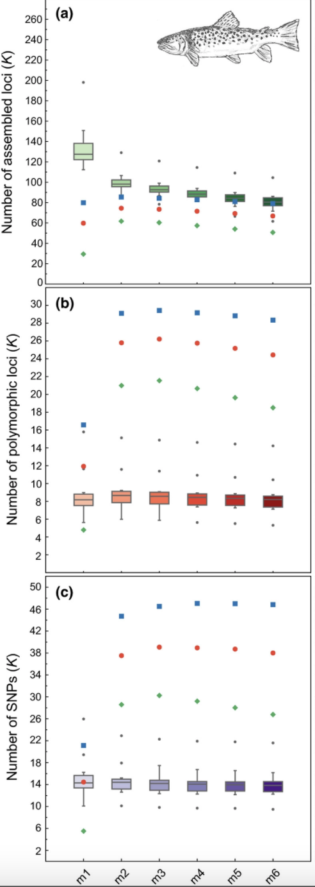

```{r, include = FALSE}
knitr::opts_chunk$set(
  collapse = TRUE,
  comment = "#>"
)
knitr::opts_chunk$set(dev = "png")
```

##### This is an example showing the usefulness of the RADstackshelpR package in reproducing the results from the paper [Lost in Parameter Space](https://doi.org/10.1111/2041-210X.12775). Here, I have downloaded the 16 raw, reduced-representation sequencing files for the brown trout dataset used in this paper, from SRA [SRR3177636-SRR317765](https://www.ncbi.nlm.nih.gov/biosample?LinkName=bioproject_biosample_all&from_uid=379215). The code below takes us step by step through the process of optimizing the de novo assembly parameters for this dataset, to ask whether the optimal parameters based on an 'R80' cutoff using Stacks v2.41 match the optimal parameters (m = 3, M = 5, and n = 4) identified in the original paper using Stacks v1.42. Bash code used to run the [STACKS](https://catchenlab.life.illinois.edu/stacks/) pipeline was executed via submit script on the KU high-performance computing cluster.

```{r}
#load packages
library(RADstackshelpR)
library(gridExtra)
```


## Step 1: Download each of the files as '.fastq.gz' from the sequence read archive (SRA)
###Bash code to execute this:
```{bash, eval = FALSE}
#!/bin/sh
#
#SBATCH --job-name=denovo.brown.trout              # Job Name
#SBATCH --nodes=1             # nodes
#SBATCH --cpus-per-task=15               # CPU allocation per Task
#SBATCH --partition=bi            # Name of the Slurm partition used
#SBATCH --chdir=/home/d669d153/work/brown.trout	# Set working d$
#SBATCH --mem-per-cpu=1gb            # memory requested
#SBATCH --time=10000

files="SRR5344602
SRR5344603
SRR5344604
SRR5344605
SRR5344606
SRR5344607
SRR5344608
SRR5344609
SRR5344610
SRR5344611
SRR5344612
SRR5344613
SRR5344614
SRR5344615
SRR5344616
SRR5344617"

#Must have the SRAtoolkit installed and in your path, or in my case loaded through conda
module load sratoolkit

#download each file
for sample in files
do
fastq-dump $sample
done

```

#### Note: If too many of your samples contain low-data, it may be difficult to determine an appropriate 'R80' cutoff, as there will be very few (even 0) SNPs shared at an 80% completeness threshold. Personally, I remove samples with demultiplexed .fast.gz file sizes below 2Mb, before starting my Stacks runs, because these samples do not have enough data to be usable downstream, and can make setting an 'R80' cutoff impossible. If you receive an errors saying "'names' attribute [2] must be the same length as the vector [1]", or "Rbind issue", you likely have too many low-data samples to compare the number of SNPs between runs at high filtering thresholds, and re-running stacks without including samples with very small file sizes should alleviate this issue. Here, all samples are high-quality, and will be retained.

## Step 2: Iterate over values of 'm' ranging from 3-7, while leaving all other parameters at default values.
###Bash code to execute this:
```{bash, eval = FALSE}
# Build loci de novo in each sample for the single-end reads only.
# -M — Maximum distance (in nucleotides) allowed between stacks (default 2).
# -m — Minimum depth of coverage required to create a stack (default 3).
#here, we will vary m from 3-7, and leave all other paramaters default

for i in {3..7}
do
#create a directory to hold this unique iteration:
mkdir stacks_m$i
#run ustacks with m equal to the current iteration (3-7) for each sample
id=1
for sample in $files
do
    /home/d669d153/work/stacks-2.41/ustacks -f fastq/${sample}.fq.gz -o stacks_m$i -i $id -m $i -p 15
    let "id+=1"
done
## Run cstacks to compile stacks between samples. Popmap is a file in working directory called 'pipeline_popmap.txt'
/home/d669d153/work/stacks-2.41/cstacks -P stacks_m$i -M pipeline_popmap.txt -p 15
## Run sstacks. Match all samples supplied in the population map against the catalog.
/home/d669d153/work/stacks-2.41/sstacks -P stacks_m$i -M pipeline_popmap.txt -p 15
## Run tsv2bam to transpose the data so it is stored by locus, instead of by sample.
/home/d669d153/work/stacks-2.41/tsv2bam -P stacks_m$i -M pipeline_popmap.txt -t 15
## Run gstacks: build a paired-end contig from the metapopulation data (if paired-reads provided),
## align reads per sample, call variant sites in the population, genotypes in each individual.
/home/d669d153/work/stacks-2.41/gstacks -P stacks_m$i -M pipeline_popmap.txt -t 15
## Run populations completely unfiltered and output unfiltered vcf, for input to the RADstackshelpR package
/home/d669d153/work/stacks-2.41/populations -P stacks_m$i -M pipeline_popmap.txt --vcf -t 15
done
```

#### Note: The vcf file output by Stacks containing only variant site information for each sample will be called 'populations.snps.vcf', unless you renamed it yourself by setting the -o flag in populations. This is the vcf file that you want to use for input to RADstackshelpR functions.

## Step 3: Visualize the output of these 5 runs and determine the optimal value for m.
```{r, dpi=300, out.width="100%",out.height="100%", fig.align = "center"}
#optimize_m function will generate summary stats on your 5 iterative runs
#input can be full path to each file or just the file name if your working directory contains the files
m.out<-optimize_m(m3="/Users/devder/Desktop/brown.trout/m3.vcf",
           m4="/Users/devder/Desktop/brown.trout/m4.vcf",
           m5="/Users/devder/Desktop/brown.trout/m5.vcf",
           m6="/Users/devder/Desktop/brown.trout/m6.vcf",
           m7="/Users/devder/Desktop/brown.trout/m7.vcf")

#visualize the effect of varying m on the depth of each sample
vis_depth(output = m.out)
#visualize the effect of varying m on the number of SNPs retained
vis_snps(output = m.out, stacks_param = "m")

#visualize the effect of varying m on the number of loci retained
vis_loci(output = m.out, stacks_param = "m")

#3 is the optimal m value, and will be used next to optimize M
```

### Here we can see the results from Paris et al. (2017) optimizing the 'm' parameter for this same dataset.

```{r}

```

### The green dots here are the 80% completeness threshold (R80), and we can see that the numbers of SNPs and polymorphic loci recovered using each scheme are not exactly the same as the numbers that we recovered here. This is likely because I am using Stacks v2.41 and this paper used Stacks v1.42. Nonetheless, we see the same pattern (a decreasing number of polymorphic loci at an 'R80' cutoff going iteratively from m=3 -> m=7).

## Step 4: Iterate over values of M ranging from 1-8, setting m to the optimal value (here 3).
### This code follows the bash chunk above, utilizing the same variable $files
```{bash, eval = FALSE}
# -M — Maximum distance (in nucleotides) allowed between stacks (default 2).
# -m — Minimum depth of coverage required to create a stack (default 3).
#here, vary M from 1-8, and set m to the optimized value based on prior visualizations (here 3)
for i in {1..8}
do
#create a directory to hold this unique iteration:
mkdir stacks_bigM$i
#run ustacks with M equal to the current iteration (1-8) for each sample, and m set to the optimized value (here, m=3)
id=1
for sample in $files
do
    /home/d669d153/work/stacks-2.41/ustacks -f fastq/${sample}.fq.gz -o stacks_bigM$i -i $id -m 3 -M $i -p 15
    let "id+=1"
done
/home/d669d153/work/stacks-2.41/cstacks -P stacks_bigM$i -M pipeline_popmap.txt -p 15
/home/d669d153/work/stacks-2.41/sstacks -P stacks_bigM$i -M pipeline_popmap.txt -p 15
/home/d669d153/work/stacks-2.41/tsv2bam -P stacks_bigM$i -M pipeline_popmap.txt -t 15
/home/d669d153/work/stacks-2.41/gstacks -P stacks_bigM$i -M pipeline_popmap.txt -t 15
/home/d669d153/work/stacks-2.41/populations -P stacks_bigM$i -M pipeline_popmap.txt --vcf -t 15
done
```

## Step 5: Visualize the output of these 8 runs and determine the optimal value for M.
```{r, dpi=300, out.width="100%",out.height="100%", fig.align = "center"}
#optimize M
M.out<-optimize_bigM(M1="/Users/devder/Desktop/brown.trout/bigM1.vcf",
           M2="/Users/devder/Desktop/brown.trout/bigM2.vcf",
           M3="/Users/devder/Desktop/brown.trout/bigM3.vcf",
           M4="/Users/devder/Desktop/brown.trout/bigM4.vcf",
           M5="/Users/devder/Desktop/brown.trout/bigM5.vcf",
           M6="/Users/devder/Desktop/brown.trout/bigM6.vcf",
           M7="/Users/devder/Desktop/brown.trout/bigM7.vcf",
           M8="/Users/devder/Desktop/brown.trout/bigM8.vcf")

#visualize the effect of varying M on the number of SNPs retained
vis_snps(output = M.out, stacks_param = "M")

#visualize the effect of varying M on the number of polymorphic loci retained
vis_loci(output = M.out, stacks_param = "M")
```

### Here we can see the results from Paris et al. (2017) optimizing the 'M' parameter for this same dataset.

```{r}
knitr::include_graphics("trt.bigM.png")
```

### Again, the green dots here are the R80 cutoff. These iterations using Stacks v1.42 do not show the same steep drop-off in the number of polymorphic loci retained at higher 'M' values that we see using Stacks v2.41. This result highlights the necessity of optimizing parameters according to the optimal output for the specific dataset and specific software being used. 

## Step 6: Iterate over values of n ranging from M-1, M, M+1, setting m and M to the optimal values (here 3 and 2, respectively).
### This code chunk runs the last three Stacks iterations, again re-using the variable $files
```{bash, eval = FALSE}
# -n — Number of mismatches allowed between sample loci when build the catalog (default 1).
#here, vary 'n' across M-1, M, and M+1 (because my optimized 'M' value = 2, I will iterate over 1, 2, and 3 here), with 'm' and 'M' set to the optimized value based on prior visualizations (here 'm' = 3, and 'M'=2).
for i in {1..3}
do
#create a directory to hold this unique iteration:
mkdir stacks_n$i
#run ustacks with n equal to the current iteration (1-3) for each sample, m = 3, and M=2
id=1
for sample in $files
do
    /home/d669d153/work/stacks-2.41/ustacks -f fastq/${sample}.fq.gz -o stacks_n$i -i $id -m 3 -M 2 -p 15
    let "id+=1"
done
/home/d669d153/work/stacks-2.41/cstacks -n $i -P stacks_n$i -M pipeline_popmap.txt -p 15
/home/d669d153/work/stacks-2.41/sstacks -P stacks_n$i -M pipeline_popmap.txt -p 15
/home/d669d153/work/stacks-2.41/tsv2bam -P stacks_n$i -M pipeline_popmap.txt -t 15
/home/d669d153/work/stacks-2.41/gstacks -P stacks_n$i -M pipeline_popmap.txt -t 15
/home/d669d153/work/stacks-2.41/populations -P stacks_n$i -M pipeline_popmap.txt --vcf -t 15
done
```

## Step 7: Visualize the output of these 3 runs and determine the optimal value for n.
```{r, dpi=300, out.width="100%",out.height="100%", fig.align = "center"}
#optimize n
n.out<-optimize_n(nequalsMminus1="/Users/devder/Desktop/brown.trout/n1.vcf",
           nequalsM="/Users/devder/Desktop/brown.trout/n2.vcf",
           nequalsMplus1="/Users/devder/Desktop/brown.trout/n3.vcf")

#visualize the effect of varying n on the number of SNPs retained
vis_snps(output = n.out, stacks_param = "n")

#visualize the effect of varying n on the number of polymorphic loci retained
vis_loci(output = n.out, stacks_param = "n")
```

# Finally, make a single figure showing the optimization process of all three parameters
```{r, dpi=300, out.width="100%",out.height="100%", fig.align = "center", fig.height=6, fig.width=8}
gl<-list()
gl[[1]]<-vis_depth(output = m.out)
gl[[2]]<-vis_snps(output = m.out, stacks_param = "m")
gl[[3]]<-vis_loci(output = m.out, stacks_param = "m")
gl[[4]]<-vis_snps(output = M.out, stacks_param = "M")
gl[[5]]<-vis_loci(output = M.out, stacks_param = "M")
gl[[6]]<-vis_snps(output = n.out, stacks_param = "n")
gl[[7]]<-vis_loci(output = n.out, stacks_param = "n")

grid.arrange(
  grobs = gl,
  widths = c(1,1,1,1,1,1),
  layout_matrix = rbind(c(1,1,2,2,3,3),
                        c(4,4,4,5,5,5),
                        c(6,6,6,7,7,7))
)
```

##### I now have a vcf file containing unfiltered SNPs for all samples, built with the optimal parameters for this dataset, 'm' = 3, 'M' = 2, and 'n'=3.
##### I will now filter this vcf file using the SNPfiltR R package, to generate a set of high quality SNPs for downstream phylogenetic/population genetic analyses.
